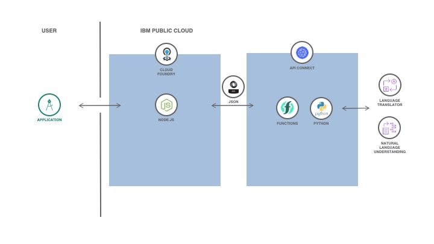

# Lyra, the song analyzer

Lyra makes use of the Watson Natural Language Understanding (NLU) API to analyze song lyrics. The backend calls a serverless function sequence that scrapes song lyrics from https://www.letras.com using Beautiful Soup and then calls NLU to analyze the song's emotion and sentiment. The analysis is supported in any language!

<!-- ## Index

* [1. Run local](#1-introdução)
* [2. Deploy](#2-deploy) -->

## Flow

## Creating the Serverless sequence and actions via IBM Cloud Functions GUI

Being logged in on IBM Cloud, open [IBM Cloud Functions](https://cloud.ibm.com/functions/actions). For every file in the [actions folder](./doc/source/actions), create an action and paste the code inside. In the `analyzeLyrics.py` action, remember to type your service apikeys:
- Line 15: Language Translator apikey
- Line 40: Natural Language Understanding apikey

If you don't have api keys, simply create a free instance of Language Translator and Natural Language Understanding on [IBM Cloud](https://cloud.ibm.com/). Then, create a sequence for scraping the lyrics. It should include the three actions, in the following order:
1. songSearcher.py
2. lyricScraper.py
3. analyzeLyrics.py

## Making your Python API Public with API Connect
Go to the [Functions API management section](https://cloud.ibm.com/functions/apimanagement) and create a Managed API. Name it whatever you like. Go to your newly created Managed API and go to the section `Definition`. There, create an operation, give it a path, set the method to `POST` and select your sequence. After creating the operation, remember to scroll down the screen and click on `Save` to save your changes. Now, go back to `Summary` and copy the route on the screen to your API. Insert this route in the [server file](./server/server.js), line 16 and add a `/<your path name>` to the end of the route. Your server should now be able to connect to your API operation.

## Running the app locally
Simpy clone the repo and run the following commands:
- 