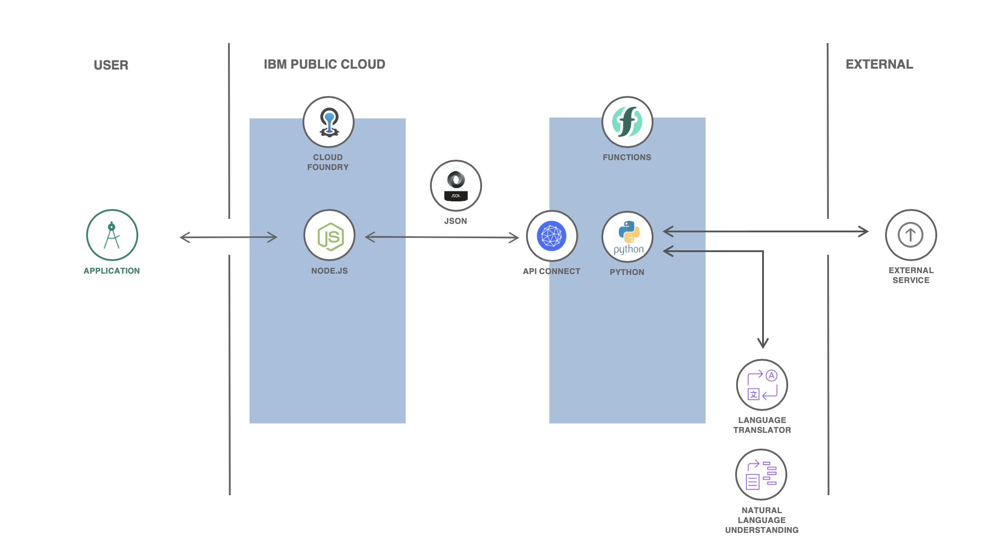

<div align="center">
<a href="https://cloud.ibm.com">

</a>
</div>

# Lyra, the song analyzer

## Intro

Lyra makes use of the Watson Natural Language Understanding (NLU) API to analyze song lyrics. The Node.js backend calls a serverless function sequence via API Connect. The sequence scrapes song lyrics from https://www.letras.com using Python with Beautiful Soup and then calls NLU to analyze the song's emotion and sentiment. If the song is not in English, the sequence also calls the Language Translator API to translate the lyrics to English. The service is supported in any language!

Check the app out on https://lyra.mybluemix.net.

## Index

* [Flow](#Flow)
* [Set up](#Creating-the-Serverless-sequence-and-actions-via-IBM-Cloud-Functions-GUI)
* [Run locally](#Running-the-app-locally)
* [Deploy](#Deploying-the-app-to-the-cloud)

## Flow


## Creating the Serverless sequence and actions via IBM Cloud Functions GUI

Being logged in on IBM Cloud, open [IBM Cloud Functions](https://cloud.ibm.com/functions/actions). For every file in the [actions folder](./doc/source/actions), create an action and paste the code inside. In the `analyzeLyrics.py` action, remember to type in your service apikeys:
- Line 15: Language Translator apikey
- Line 40: Natural Language Understanding apikey

If you don't have the apikeys, simply create a free instance of [Language Translator](https://cloud.ibm.com/catalog/services/language-translator) and [Natural Language Understanding](https://cloud.ibm.com/catalog/services/natural-language-understanding) to get them. Then, create a sequence for scraping and analyzing the lyrics. It should include the three actions, in the following order:
1. songSearcher.py
2. lyricScraper.py
3. analyzeLyrics.py

## Making your Python API Public with API Connect
Go to the [Functions API management section](https://cloud.ibm.com/functions/apimanagement) and create a Managed API. Name it whatever you like. Go to your newly created Managed API and go to the section `Definition`. There, create an operation, give it a path, set the method to `POST` and select your sequence. After creating the operation, remember to scroll down the screen and click on `Save` to save your changes. Now, go back to `Summary` and copy the route on the screen to your API. Insert this route in the [server file](./server/server.js), line 16 and add `/<your path name>` to the end of the route. Your server should now be able to connect to your API operation.

## Running the app locally
Simpy clone the repo, put your API route in the server file (step above) and run the following commands from the `/server` directory:

```
# Installs dependencies
npm run install-deps

# Builds app and runs locally
npm run local
```

## Deploying the app to the cloud
NOTE: You must have the [IBM Cloud Command Line Interface](https://cloud.ibm.com/docs/cli?topic=cloud-cli-getting-started) installed on your machine to follow this step.

After [setting up](#Creating-the-Serverless-sequence-and-actions-via-IBM-Cloud-Functions-GUI), installing dependencies and making sure the app is working, go to the `/server` directory, change your app and route names on the [manifest file](./server/manifest.yml) (lines 3 and 8) and run the following commands from `/server`:

```
# Logs into the IBM Cloud
ibmcloud login

# Selects a Cloud Foundry organization and space to deploy your app
ibmcloud target --cf

# Builds the client and deploys app to cloud
npm run deploy
```

## License
Copyright 2019 Daniel T. Rodrigues

Licensed under the Apache License, Version 2.0 (the "License");
you may not use this file except in compliance with the License.
You may obtain a copy of the License at

    http://www.apache.org/licenses/LICENSE-2.0

Unless required by applicable law or agreed to in writing, software
distributed under the License is distributed on an "AS IS" BASIS,
WITHOUT WARRANTIES OR CONDITIONS OF ANY KIND, either express or implied.
See the License for the specific language governing permissions and
limitations under the License.